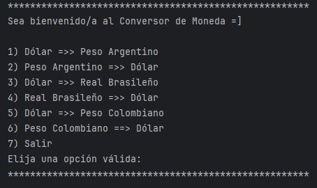
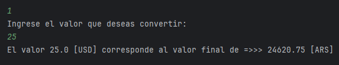
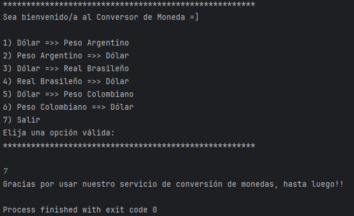

# conversor-de-monedas
Desafío com.aluracursos.api.Conversor de Monedas del curso "Java Orientado a Objetos G7 - ONE" Oracle Next Education en conjunto con Alura Latam

## Descripción
Este proyecto te permite realizar la conversión de monedas internacionales consumiendo una API.
Presenta un menú de 7 opciones, donde cada opción realiza una conversión diferente, la opción 7 te permite salir del menú.

Al ingresar una opción que no sea la 7, se le pedirá ingresar la cantidad a convertir y al dar enter se mostrará en pantalla el mensaje con el total de la conversión

Al ingresar 7, se sale del menú y finaliza el programa

## Herramientas utilizadas
- IDE: IntelliJ IDEA
- Versión de Java: 17.0.12
- Librería: Gson 2.10.1
- API: https://www.exchangerate-api.com/

## Las conversiones que se pueden realizar
- Pesos Argentinos a Dólares (ARS - USD) y visceversa
- Reales a Dólares (BRL - USD) y visceversa
- Pesos Colombianos a Dólares (COP - USD) y visceversa

## Uso
1. Clona el repositorio.
2. Abre tu ide preferido

## Autor
**Natanael Dominguez**
[Repositorio en GitHub](https://github.com/natanaelDominguez28/conversor-de-monedas)
